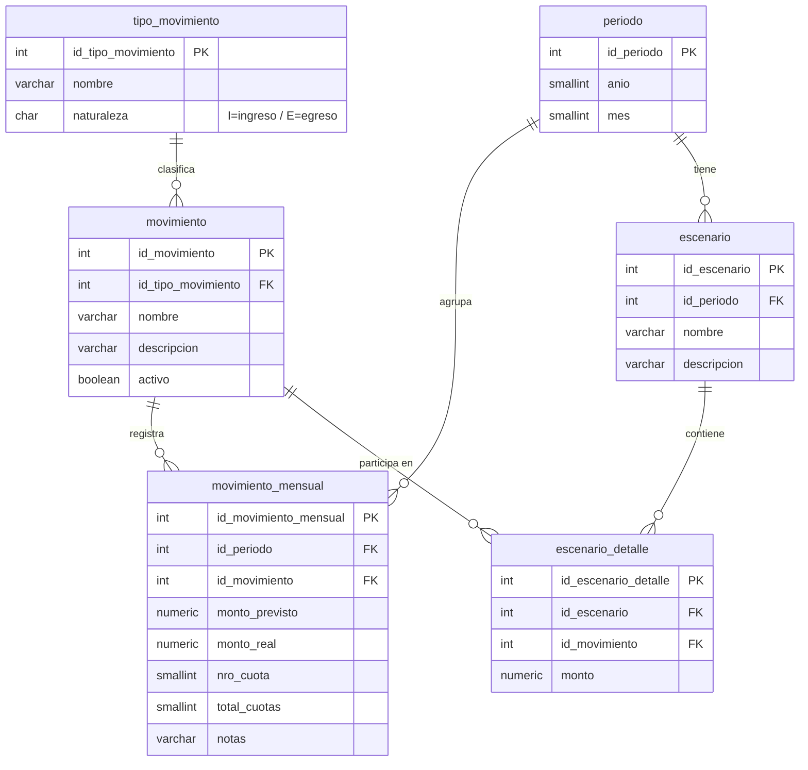

# Finanzas Manager

API REST reactiva para gestionar ingresos y egresos mensuales. Permite registrar movimientos por categoría, comparar montos previstos con reales y simular escenarios financieros.

## Stack tecnológico

| Capa | Tecnología |
|---|---|
| Lenguaje | Java 21 |
| Framework | Spring Boot 4.x (WebFlux — reactivo) |
| Base de datos | PostgreSQL 17 + R2DBC |
| Migraciones | Flyway |
| Cache | Redis 7 |
| Mensajería | RabbitMQ 3 |
| Búsqueda | Elasticsearch 8 |
| Build | Maven (Maven Wrapper) |
| Contenedores | Docker + Docker Compose |

## Historias de usuario

| HU | Descripción | Estado |
|---|---|---|
| HU-01 | Autenticación con Keycloak | Completada |
| HU-02 | Diseño e inicialización del esquema de base de datos PostgreSQL | Completada |
| HU-03 | Endpoint GET — Consulta de gastos mensuales | En curso |
| HU-04 | Endpoint POST — Guardar nuevo gasto mensual | Pendiente |
| HU-05 | Endpoint POST — Crear nuevo tipo de gasto mensual | Pendiente |
| HU-06 | Endpoint GET — Consultar tipos de gasto del usuario | Pendiente |
| HU-07 | Endpoint DELETE — Eliminar gasto mensual | Pendiente |
| HU-08 | Endpoint GET — Resumen/dashboard de gastos por categoría | Pendiente |

## Modelo de datos



Las vistas `v_resumen_mensual` y `v_resumen_escenario` calculan totales y saldo sin almacenarlos.

## Levantar en local con Docker

### Prerrequisitos

- [Docker Desktop](https://www.docker.com/products/docker-desktop/) instalado y corriendo
- Git

### Pasos

```bash
# 1. Clonar el repositorio
git clone https://github.com/CaroBima/finanzas-manager.git
cd finanzas-manager

# 2. Construir y levantar todos los servicios
docker compose up --build
```

La primera vez descarga las imágenes base y compila el JAR dentro del contenedor (puede tardar unos minutos). Las siguientes veces levanta más rápido porque Docker cachea las capas.

### Servicios que levanta

| Servicio | Puerto local | URL / acceso |
|---|---|---|
| API (Spring Boot) | `8081` | `http://localhost:8081` |
| PostgreSQL | `5432` | host `localhost`, db `finanzas`, user `postgres` |
| Redis | `6379` | — |
| RabbitMQ | `5672` | — |
| RabbitMQ Management UI | `15672` | `http://localhost:15672` (guest / guest) |
| Elasticsearch | `9200` | `http://localhost:9200` |

### Comandos útiles

```bash
# Levantar en background
docker compose up --build -d

# Ver logs de la API
docker compose logs -f finanzas-manager

# Detener todos los servicios
docker compose down

# Detener y borrar volúmenes (base de datos incluida)
docker compose down -v

# Seedear los datos en la bd
Get-Content finanzas-manager-back\src\main\resources\db\dev\V3__seed_data.sql | docker exec -i finanzas-postgres psql -U postgres -d finanzas
```

### Variables de entorno

Todas tienen valores por defecto para desarrollo local. Para personalizar, se puede crear un archivo `.env` en la raíz del proyecto:

```env
SERVER_PORT=8081

DATABASE_FINANZAS_MANAGER=r2dbc:postgresql://postgres:5432/finanzas
DBUSER=postgres
DBPASSWORD=postgres

REDIS_HOST=redis
REDIS_PORT=6379

RABBITMQ_HOST=rabbitmq
RABBITMQ_PORT=5672
RABBITMQ_USER=guest
RABBITMQ_PASSWORD=guest

ELASTICSEARCH_HOST=elasticsearch
ELASTICSEARCH_PORT=9200
```

## Estructura del proyecto

```
finanzas-manager/
├── src/
│   └── main/
│       ├── java/org/cbpersonalproject/
│       │   ├── controller/
│       │   ├── service/
│       │   ├── dto/
│       │   └── model/
│       └── resources/
│           ├── application.properties
│           ├── application-dev.properties
│           └── db/
│               ├── migration/         ← migraciones Flyway (todos los entornos)
│               │   ├── V1__create_schema.sql
│               │   └── V2__create_views.sql
│               └── dev/               ← solo perfil dev
│                   └── V3__seed_data.sql
├── Docs/                              ← diagramas y documentación
├── Dockerfile
├── docker-compose.yml
└── pom.xml
```

## Endpoints disponibles

> Base URL: `http://localhost:8081`

| Método | Path | Descripción | HU |
|---|---|---|---|
| `GET` | `/movimientos-mensuales` | Consultar movimientos de un periodo | HU-03 |

_Los demás endpoints están en desarrollo según el backlog de issues._

## Contribuir

1. Crear una rama desde `develop`: `git checkout -b feature/HU-XX-descripcion`
2. Implementar y verificar localmente con `docker compose up --build`
3. Abrir un Pull Request hacia `develop`
